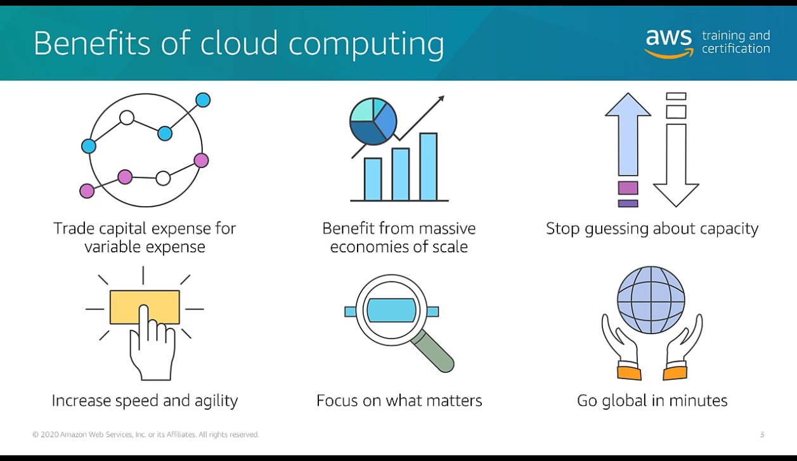
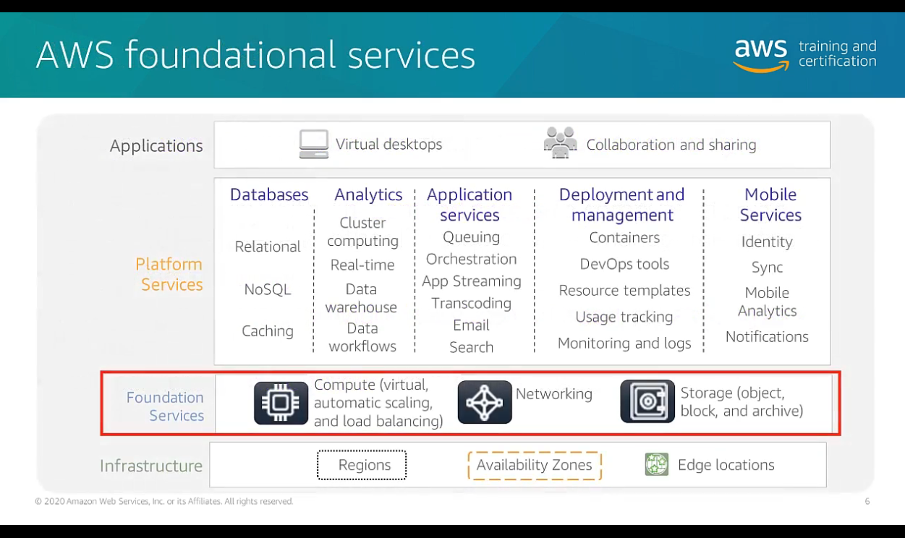

# AWS Foundations: Getting Started with the AWS Cloud Essentials (AWS Official Content)

Descrição: Conheça os conceitos básicos na Nuvem AWS. Neste curso, você conhece a arquitetura da Nuvem AWS e os serviços nas categorias computação, armazenamento, banco de dados, redes e segurança.

Este curso pode ajudá-lo a criar e validar uma compreensão geral da Nuvem AWS e terminologia chave, além de ajudar a desenvolver suas habilidades na Nuvem AWS.

Nível do curso: Fundamental

Método de entrega: Treinamento digital

Duração: 1 hora

Objetivos do curso: Neste curso, você aprenderá a:

✅ Descrever a proposição de valor da Nuvem AWS

✅ Descrever a infraestrutura global básica da nuvem

✅ Descrever e diferenciar os domínios de serviço da AWS

✅ Explicar o modelo de responsabilidade compartilhada

✅ Descrever a definição de preço da AWS

Público-alvo: Responsáveis pela tomada de decisões empresariais de TI e indivíduos que buscam uma compreensão geral da Nuvem AWS.

Linhas gerais do curso: O que é computação em nuvem? Infraestrutura global da AWS. Computação, armazenamento banco de dados, redes, segurança e definição de preço.

# What exactly is cloud computing?

Cloud computing enables you to stop thinking of your infrastructure as hardware, and instead think of (and use) it as a software.

=> Para simplificar, computação em nuvem é um termo amplamente utilizado para definir a entrega sob demanda de recurso de TI e aplicações, com a definição de preço do tipo pague conforme o uso.

# Benefits of cloud computing

- Trade capital expense for variable expense;
- Benefit from massive economies of scale;
- Stop guessing about capacity;
- Increase speed and agility;
- Focus on what matters;
- Go global in a minutes.

## Cloud computing deployment models
Há três modelos principais de implantação de computação em nuvem, que representam os ambientes de nuvem nos quias é possível implantar suas aplicações.

- ### **Cloud**
  - Uma aplicação baseada em nuvem é totalmente implantada na nuvem. E todas as partes da aplicação são executadas na nuvem;
  - As aplicações da nuvem foram criadas originalmente na nuvem ou migradas de uma infraestrutura existente para aproveitar os benefícios da Cloud computing.

- ### **Hybrid**
  - Uma implantação híbrida é uma maneira de conectar infraestrutura e aplicações entre recursos de nuvem e recursos existentes. Eles não estão hospedados na nuvem;
  - É uma maneira de conectar infraestrutura e aplicações, entre recursos de nuvem e recursos existentes que não estão localizados na nuvem;
  - O método mais comum de implantação híbrida é entre a nuvem e a infraestrutura on-premises existente;
  - Esse modelo permite que uma organização amplie e expanda a infraestrutura para a nuvem, enquanto conecta recursos de nuvem a sistemas internos.

- ### **On-premises(private cloud)**
  - A implantação de recursos on-premises usando ferramentas de virtualização e gerenciamento de recursos é chamada de nuvem privada;
  - A implantação on-premises não oferece muitos dos benefícios da Cloud computing, mas, às vezes, é preferida por sua capacidade de oferecer recursos dedicados;
  - Na maioria dos casos, este modelo de implantação é igual a infraestrutura de TI herdada, mas também pode usar  tecnologias de virtualização e gerenciamento de aplicações para aumentar a utilização de recursos.

# What is AWS ?
- AWS is a secure cloud platform that offers a broad set of global cloud-based products;
- AWS provides you with on-demand access to compute, storage, network, database, and other IT resources and management tools;
- AWS offers flexibility;
- You pay only for the individual services you need, for as long as you use them;
- AWS services work together like building blocks.

A infraestrutura global da AWS, fornece a plataforma para um conjunto mais amplo de serviços, como redes, armazenamento, computação e banco de dados, sendo 23 produtos ou categorias de serviços diferentes, e cada categoria consiste em um ou mais serviços.
